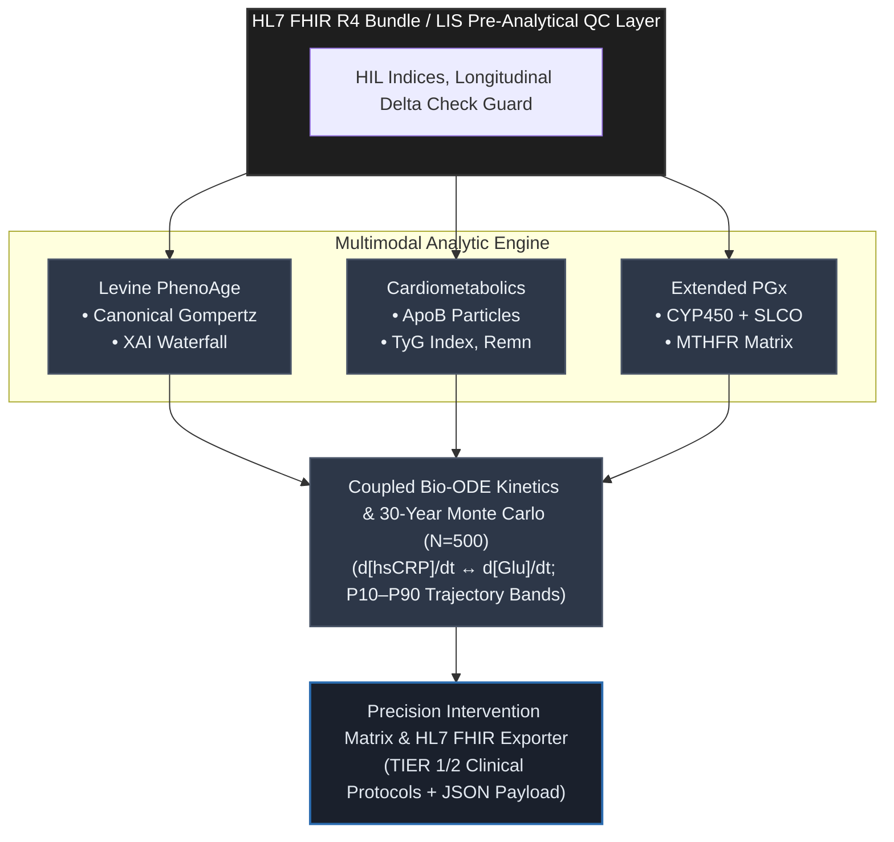

# 🧬 AeternaCore OS: Sovereign Longevity & Intelligence Platform (v2.0)
### *Clinical Biostatistics • Epigenetic Clocks • Pre-Analytical HIL • TyG/ApoB Cardiometabolics • Monte Carlo 30Y • HL7 FHIR R4 • CPIC PGx*

[**English Version**](#-english-version) &nbsp;•&nbsp; [**Wersja Polska**](#-wersja-polska)

---

## 🇬🇧 English Version

### 🔬 Vision & Overview
**AeternaCore OS (v2.0)** is an enterprise-grade clinical longevity intelligence platform. It bridges the gap between routine laboratory diagnostics (**LIS**), multi-omic parametric biostatistics, pre-analytical quality assurance, and explainable artificial intelligence (XAI).

Operating with **100% sovereign client-side execution**, all mathematical modeling, Monte Carlo stochastic simulations, and dynamic i18n dictionary state transitions execute strictly within local browser RAM.

## 📐 System Architecture & Pipeline

### 🧬 Architectural Specifications

| Stage | Component | Key Operations / Analytical Framework |
| :--- | :--- | :--- |
| **01. Ingestion & QC** | `HL7 FHIR R4 Bundle / LIS QC` | • Pre-analytical HIL (Hemolysis, Icterus, Lipemia) validation • Longitudinal Delta Check guardrail algorithms |
| **02. Phenotypic Risk** | `Levine PhenoAge` | • Canonical Gompertz biological mortality acceleration • Feature attribution & SHAP/XAI Waterfall decomposition |
| **03. Cardiometabolics** | `Cardiometabolics Engine` | • Atherogenic particle stratification (ApoB) • Insulin resistance proxy: TyG Index & Remnant-C |
| **04. Pharmacogenomics** | `Extended PGx` | • CYP450 metabolic phenotyping & SLCO hepatic transport • One-carbon metabolism & MTHFR functional matrix |
| **05. Dynamical Modeling** | `Coupled Bio-ODE & Monte Carlo` | • Non-linear coupling: $\frac{d[\text{hsCRP}]}{dt} \leftrightarrow \frac{d[\text{Glu}]}{dt}$ • Stochastic trajectory forecasting ($N=500$, P10–P90 bands) |
| **06. Clinical Export** | `Precision Intervention Matrix` | • Actionable evidence-based stratification (TIER 1/2 protocols) • Standardized HL7 FHIR-compliant diagnostic JSON payload |

---

### ⚡ Comprehensive V2.0 Clinical Modules

1. **🌊 Explainable AI (SHAP Waterfall)**: Granular biomarker decomposition relative to chronological age baseline anchor.
2. **🫀 Advanced Cardiometabolics**: Quantification of ApoB particle burden, TyG Index (hepatic/systemic insulin resistance), and remnant cholesterol.
3. **📈 Monte Carlo 30Y Simulation ($N=500$)**: Stochastic forecasting comparing passive natural aging drift vs. targeted multi-modal optimization.
4. **🛡 Pre-Analytical HIL & Delta Check**: Automated laboratory verification of serum indices (Hemolysis, Icterus, Lipemia) and longitudinal hsCRP rate variance.
5. **🎯 Bio-ODE Coupling & Interventions**: Coupled ordinary differential equations tracking inflammatory-glycemic feedback loops.
6. **🛡 Pharmacogenomics & FHIR R4**: CPIC-compliant drug-gene firewall paired with native `DiagnosticReport` JSON generation.

---

### 📑 Extended Diagnostic LOINC Ontology Standard

| LOINC Code | Biomarker Description | Unit Standard | Longevity Target |
| :--- | :--- | :--- | :--- |
| `1751-7` | Serum Albumin | g/L | ≥ 45.0 g/L |
| `2160-0` | Serum Creatinine | µmol/L | 65.0 - 85.0 µmol/L |
| `2345-7` | Fasting Plasma Glucose | mmol/L | 4.0 - 5.0 mmol/L |
| `30522-7` | High-Sensitivity CRP (hsCRP) | mg/L | < 0.8 mg/L |
| `26474-7` | Lymphocyte Percentage | % | 30.0 - 38.0% |
| `789-8` | Red Cell Distribution Width (RDW) | % | < 12.5% |
| `1884-6` | Apolipoprotein B (ApoB) | mg/dL | < 70.0 - 80.0 mg/dL |
| `2571-8` | Triglycerides (TG) | mg/dL | < 100.0 mg/dL |
| `2085-9` | HDL Cholesterol (HDL-C) | mg/dL | > 50.0 - 60.0 mg/dL |

---

## 🇵🇱 Wersja Polska

### 🔬 Wizja i Przeznaczenie Systemu (v2.0)
**AeternaCore OS (v2.0)** to suwerenna platforma medycyny precyzyjnej i diagnostyki długowieczności. Łączy analitykę laboratoryjną (**LIS**), biostatystykę przeżywalności, zaawansowaną kontrolę jakości fazy przedanalitycznej oraz wyjaśnialne uczenie maszynowe (XAI).

System wykonuje 100% obliczeń, modelowania i symulacji stochastycznych w pamięci lokalnej przeglądarki klienta, gwarantując integralność danych pacjenta.

---

### ⚡ Moduły Diagnostyczne Systemu

1. **🌊 Wyjaśnialna Dekompozycja Wieku (SHAP Waterfall)**: Identyfikacja przesunięć lat biologicznych per biomarker.
2. **🫀 Kardiometabolika i Lipidom Nowej Generacji**: Pomiar aterogennych cząstek ApoB, wskaźnika TyG (surogat insulinooporności) oraz cholesterolu remnantów.
3. **📈 Symulacja Stochastyczna Monte Carlo (30 Lat, $N=500$)**: Modelowanie trajektorii starzenia biologicznego z pasmami percentylowymi P10–P90.
4. **🛡 Walidacja Przedanalityczna HIL & Delta Check**: Automatyczna detekcja interferencji (hemoliza, lipemia) oraz podłużnej dynamiki kinetycznej hsCRP.
5. **🎯 Kinetyka Bio-ODE & Plan Interwencji**: Równania różniczkowe sprzężenia zapalno-glikemicznego wraz ze spersonalizowanymi protokołami TIER 1/2.
6. **🛡 Firewall PGx (CPIC) & Standard HL7 FHIR R4**: Weryfikacja interakcji farmakogenomicznych i eksport szpitalnych raportów `DiagnosticReport`.

---

## ⚖️ Legal, Clinical & Regulatory Disclaimer / Zastrzeżenie Prawne

### 🇬🇧 English: Research & Educational Proof of Concept (PoC)
> **IMPORTANT NOTICE:** **AeternaCore OS** is an experimental, open-source computational **Proof of Concept (PoC)** developed strictly for educational, scientific research, and architectural demonstration purposes.
>
> 1. **Non-Medical Device Status:** This software is **NOT** a certified Medical Device under EU MDR 2017/745 or US FDA regulations. It is not intended for clinical diagnosis, treatment, or disease prevention.
> 2. **No Medical Advice:** All calculations (PhenoAge, DunedinPACE, TyG, PGx alerts) are mathematical simulations and do not replace certified medical consultation.
> 3. **Limitation of Liability:** Authors assume no legal liability for any decisions made based on this software.

---

### 🇵🇱 Polski: Eksperymentalny Demonstrator Badawczy (PoC)
> **WAŻNA INFORMACJA PRAWNA:** **AeternaCore OS** jest eksperymentalnym modelem obliczeniowym typu **Proof of Concept (PoC)**, stworzonym wyłącznie do celów edukacyjnych i badawczo-naukowych.
>
> 1. **Brak statusu wyrobu medycznego:** Oprogramowanie **NIE JEST** wyrobem medycznym w rozumieniu MDR 2017/745 ani wytycznych FDA.
> 2. **Brak porady medycznej:** Wyniki algorytmiczne stanowią symulacje biostatystyczne i nie zastępują indywidualnej diagnozy lekarskiej ani profesjonalnych badań laboratoryjnych.
> 3. **Wyłączenie odpowiedzialności:** Autor nie ponosi odpowiedzialności prawnej ani cywilnej za decyzje terapeutyczne podejmowane na podstawie prezentowanych wyników.

---

### 👨‍🔬 Autor / Author
**Mateusz Jakubowski**
* *Biolog Eksperymentalny & Starszy Technolog Laboratoryjny*
* *Experimental Biologist & Medical Laboratory Technologist*
* *#FromPipetteToPython | #BuildInPublic*
