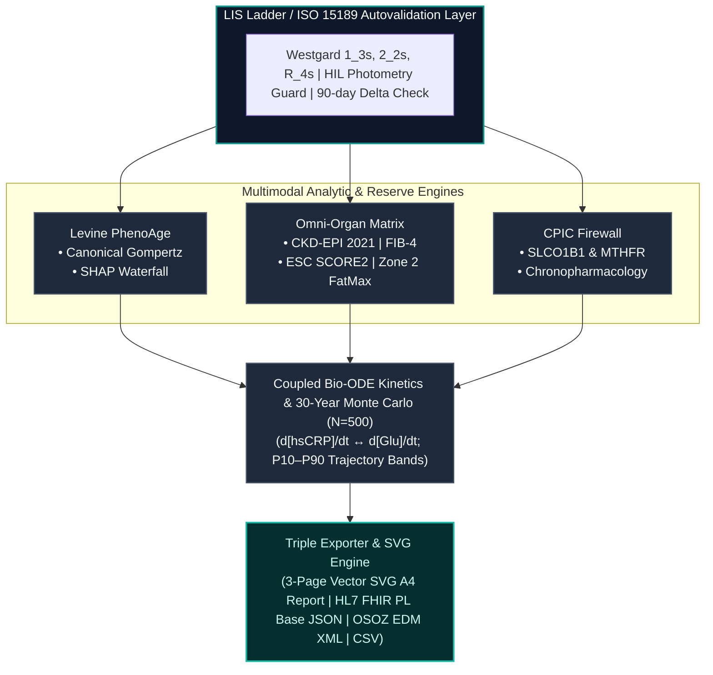

<div align="center">

# 🧬 AeternaCore OS: Sovereign Longevity & LIS Enterprise Suite (v3.0)
### *PN-EN ISO 15189:2023 LIS Guard • Levine PhenoAge (NHANES III) • CKD-EPI 2021 • FIB-4 • ESC SCORE2 • TyG/ApoB • Monte Carlo 30Y • HL7 FHIR PL Base • CPIC PGx*

[](https://huggingface.co/spaces/matthewjakubowski/aeternacore-longevity-os)
[](https://github.com/MatthewJakubowski)
[](https://opensource.org/licenses/MIT)
[](https://hl7.org/fhir/)
[](#)
[](https://cpicpgx.org/)
[](#)

[**English Version**](#-english-version) &nbsp;•&nbsp; [**Wersja Polska**](#-wersja-polska) &nbsp;•&nbsp; [**Live Showcase**](https://mateusz-jakubowski.ai.studio/)

</div>

---

## 🇬🇧 English Version

### 🔬 Vision & Overview
**AeternaCore OS (v3.0 God Mode)** is an enterprise-grade sovereign clinical intelligence and laboratory automation system. It bridges routine medical diagnostic workflows (LIS/LIMS), automated quality autovalidation under **PN-EN ISO 15189:2023-02**, multi-organ reserve scoring, stochastic longevity trajectory modeling, and explainable artificial intelligence (XAI).

Operating with **100% sovereign client-side execution**, all mathematical modeling, Monte Carlo stochastic simulations, and dynamic dictionary state transitions execute strictly within local browser RAM.

---

## 📐 System Architecture & Pipeline



### 🧬 Architectural Specifications

| Stage | Component | Key Operations / Analytical Framework |
| :--- | :--- | :--- |
| **01. Ingestion & QC** | `5-Level LIS Ladder` | • PN-EN ISO 15189:2023 statistical quality control (Westgard $1_{3s}$, $2_{2s}$, $R_{4s}$)<br><br>• Automated HIL spectrophotometry guard (Hemolysis, Icterus, Lipemia)<br><br>• Life-threatening panic range detection & 90-day Delta Check |
| **02. Biological Age** | `Levine PhenoAge` | • Canonical Gompertz parametric hazard calibration (NHANES III cohort)<br><br>• Granular 9-biomarker SHAP waterfall biological year shifts |
| **03. Multi-Organ Reserves** | `Omni-Organ Matrix` | • Raceless CKD-EPI 2021 glomerular filtration rate (`eGFR`)<br><br>• Hepatic Fibrosis Index (`FIB-4`) via AST/ALT/PLT dynamics<br><br>• 10-year CVD mortality risk via ESC SCORE2 (Poland High-Risk Region)<br><br>• Mitochondrial FatMax heart rate targeting (Zone 2) |
| **04. Pharmacogenomics** | `CPIC Firewall` | • SLCO1B1 transporter risk assessment (Atorvastatin/Simvastatin collision)<br><br>• MTHFR 677C>T one-carbon methylation deficit stratification<br><br>• Chronopharmacology and optimal evening HMG-CoA dosing window |
| **05. Dynamical Forecast** | `Bio-ODE & Monte Carlo` | • Coupled differential equations: $\frac{d[\text{hsCRP}]}{dt} \leftrightarrow \frac{d[\text{Glu}]}{dt}$ over 24 months<br><br>• Stochastic trajectory forecasting ($N = 500$, 30 years, P10–P90 percentiles) |
| **06. Clinical Export** | `Triple Exporter & SVG` | • Zero-glitch, 3-page dedicated vector SVG A4 printing engine<br><br>• HL7 FHIR PL Base `DiagnosticReport` JSON serialization<br><br>• Hospital electronic documentation (OSOZ EDM XML) and research vector CSV |

---

### 📑 Extended Diagnostic LOINC Ontology Standard

| LOINC Code | Biomarker Description | Clinical Method | Reference Range |
| :--- | :--- | :--- | :--- |
| `1751-7` | Serum Albumin | BCP Dye-Binding (Alinity c) | 35.0 - 52.0 g/L |
| `2160-0` | Serum Creatinine | Enzymatic IDMS (Alinity c) | 62 - 106 µmol/L |
| `2345-7` | Fasting Plasma Glucose | Hexokinase UV (Alinity c) | 3.9 - 5.5 mmol/L |
| `30522-7` | High-Sensitivity CRP (hsCRP) | Immunoturbidimetric | < 1.00 mg/L |
| `26474-7` | Lymphocyte Percentage | Flow Cytometry (Sysmex XN) | 20.0 - 45.0 % |
| `789-8` | Red Cell Distribution Width (RDW) | Impedance (Sysmex XN) | 11.5 - 14.5 % |
| `777-3` | Platelet Count (PLT) | Impedance / Optical (Sysmex) | 150 - 450 $10^9$/L |
| `1920-8` | Aspartate Aminotransferase (AST) | IFCC without Pyridoxal | < 35 U/L |
| `1742-6` | Alanine Aminotransferase (ALT) | IFCC without Pyridoxal | < 45 U/L |
| `1884-6` | Apolipoprotein B (ApoB) | Immunoturbidimetric | < 80 mg/dL |

---

## 🇵🇱 Wersja Polska

### 🔬 Wizja i Przeznaczenie Systemu (v3.0 God Mode)

**AeternaCore OS (v3.0)** to suwerenny monolit informatyczny łączący rygor laboratoryjnej kontroli jakości (LIS/LIMS), autowalidację analityczną zgodną z normą **PN-EN ISO 15189:2023-02**, zaawansowaną biostatystykę narządową oraz wyjaśnialne uczenie maszynowe (XAI).

System wykonuje 100% obliczeń, symulacji stochastycznych i renderowania raportów w pamięci RAM przeglądarki, gwarantując integralność danych osobowych pacjenta i brak wycieku informacji poza stację roboczą.

---

### ⚡ Kluczowe Moduły Kliniczne v3.0

1. **🧪 5-Stopniowa Drabina Autowalidacji LIS & Audit Trail:** Weryfikacja reguł Westgarda, spektrofotometrii HIL (hemoliza, lipemia, żółtaczka), wartości krytycznych (panic ranges) oraz 90-dniowego wskaźnika Delta Check z nienaruszalnym logiem zdarzeń.
2. **🧬 Wyjaśnialna Dekompozycja Wieku (SHAP Waterfall):** Matematyczna kaskada przesunięć lat biologicznych w modelu Gompertza (kalibracja na kohorcie NHANES III).
3. **🫀 Zintegrowana Ocena Rezerw Narządowych:** Bezrasowy eGFR CKD-EPI 2021, wskaźnik zwłóknienia wątroby FIB-4, model ESC SCORE2 (dla regionu Polski wysokiego ryzyka) oraz strefa tlenowa FatMax (Zone 2).
4. **🩸 Zaawansowana Kardiometabolika:** Ilościowe obciążenie cząstkami ApoB, surogat insulinooporności TyG Index oraz frakcja cholesterolu remnantów.
5. **📈 Stochastyczna Symulacja Monte Carlo (30 Lat, $N = 500$):** Porównanie pasywnego dryfu starzenia z optymalną ścieżką interwencyjną (pasma P10–P90).
6. **🛡️ Firewall Farmakogenomiczny CPIC & Potrójny Eksport:** Weryfikacja polimorfizmów SLCO1B1 i MTHFR, generowanie raportu medycznego A4 w wektorze SVG, eksport HL7 FHIR PL Base JSON, szpitalnego OSOZ EDM XML oraz badawczego wektora CSV.

---

### 🚀 Quick Start (Local & Static Deployment)

Because **AeternaCore OS** is designed as a standalone, zero-dependency client-side monolith, running or deploying it requires no backend server:

```bash
# 1. Clone the repository
git clone https://github.com/MatthewJakubowski/AeternaCore-Longevity-OS.git

# 2. Navigate to directory
cd AeternaCore-Longevity-OS

# 3. Open directly in any modern browser
open index.html
# Or serve locally:
# python3 -m http.server 8000

```

## ⚖️ Legal, Clinical & Regulatory Disclaimer / Zastrzeżenie Prawne

### 🇬🇧 English: Research & Educational Proof of Concept (PoC)

> **IMPORTANT NOTICE: AeternaCore OS** is an experimental computational **Proof of Concept (PoC)** developed strictly for educational, scientific research, and architectural demonstration purposes.
>
> 1. **Non-Medical Device Status:** This software is **NOT** a certified Medical Device under EU MDR 2017/745 or US FDA regulations. It is not intended for clinical diagnosis, treatment, or disease prevention.
> 2. **No Medical Advice:** All calculations (PhenoAge, DunedinPACE, TyG, eGFR, FIB-4, SCORE2, PGx alerts) are mathematical simulations and do not replace certified medical consultation.
> 3. **Limitation of Liability:** Authors assume no legal liability for any medical or therapeutic decisions made based on this software.

---

### 🇵🇱 Polski: Eksperymentalny Demonstrator Badawczy (PoC)

> **WAŻNA INFORMACJA PRAWNA: AeternaCore OS** jest eksperymentalnym demonstratorem technologicznym typu **Proof of Concept (PoC)**, stworzonym wyłącznie do celów edukacyjnych i badawczo-naukowych.
>
> 1. **Brak statusu wyrobu medycznego:** Oprogramowanie **NIE JEST** wyrobem medycznym w rozumieniu rozporządzenia MDR (UE 2017/745) ani wytycznych FDA.
> 2. **Brak porady medycznej:** Wszystkie wyliczenia stanowią symulacje biostatystyczne i nie zastępują całościowej diagnozy lekarskiej ani autoryzowanych wyników laboratoryjnych.
> 3. **Wyłączenie odpowiedzialności:** Autorzy nie ponoszą odpowiedzialności cywilnej ani prawnej za jakiekolwiek decyzje kliniczne podejmowane na podstawie działania aplikacji.

---

### 👨‍🔬 Autor / Author

**Mateusz Jakubowski**

* *Biolog Eksperymentalny & Starszy Technolog Laboratoryjny*
* *Experimental Biologist & Medical Laboratory Technologist*
* `#FromPipetteToPython` | `#BuildInPublic`

🌐 **Portfolio & Showcases:**
* [AI Studio Showcase](https://mateusz-jakubowski.ai.studio/)
* [Pipeline AI Project Space](https://from-pipette-to-python.ai.studio/)
* [GitHub Profile](https://github.com/MatthewJakubowski)
* [Hugging Face Profile](https://huggingface.co/matthewjakubowski)
